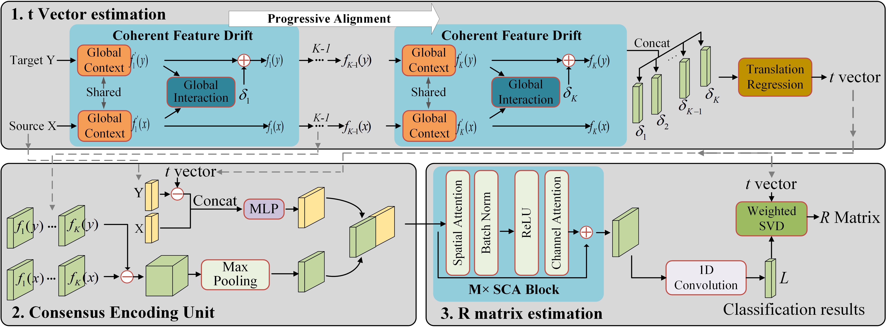

# DetarNet: Decoupling Translation and Rotation by Siamese Network for Point Cloud Registration

<!-- [[arXiv]](https://arxiv.org) -->

## Introduction
Point cloud registration is a fundamental step for many tasks. In this paper, we propose a neural network named DetarNet to decouple the translation $t$ and rotation $R$, so as to overcome the performance degradation due to their mutual interference in point cloud registration.
First, a Siamese Network based Progressive and Coherent Feature Drift (PCFD) module is proposed to align the source and target points in high-dimensional feature space, and accurately recover translation from the alignment process. Then we propose a Consensus Encoding Unit (CEU) to construct more distinguishable features for a set of putative correspondences. After that, a Spatial and Channel Attention (SCA) block is adopted to build a classification network for finding good correspondences. Finally, the rotation is obtained by Singular Value Decomposition (SVD). In this way, the proposed network decouples the estimation of translation and rotation, resulting in better performance for both of them. 
Experimental results demonstrate that the proposed DetarNet improves registration performance on both indoor and outdoor scenes.


## Requirements

All the experiments are conducted on a machine with an INTEL Xeon E5-2620 CPU and a single NVIDIA GTX1080Ti. The cuda version is 10.2. To prepare the required libraries, you can run the follows code:
``` bash
pip install -r requirements.txt
```

## Data and Model
Download the processed [Sun3d](https://drive.google.com/file/d/1ARm1bRLL8yY9dJMeuaSyvAHL6sMkzn5Y/view?usp=sharing), [KITTI](https://drive.google.com/file/d/1oJ1EmndQL7T0B_UnGCRZMjGilS-EGGkd/view?usp=sharing) and [7scenes](https://drive.google.com/file/d/1Q9Q1nf2STVnh1Vc9g5ZJZ5kT-H3c9geh/view?usp=sharing) datasets.

Download the [pretrained models](https://drive.google.com/file/d/1qudc_K96yDDXUlFAWe_6PtreXz-vxC6E/view?usp=sharing) for Sun3d and KITTI datasets.

## Training
Train the model on Sun3d dataset:
```
python main.py --data_tr=sun3d --run_mode=train --log_dir=[NAME] 
```

Train the model on KITTI dataset:
```
python main.py --data_tr=KITTI --run_mode=train --log_dir=[NAME] 
```

## Testing
Test the pretrained model on Sun3d dataset:
```
python main.py --data_te=sun3d --run_mode=test --log_dir=sun3d_model
```

Test the pretrained model on KITTI dataset:
```
python main.py --data_te=KITTI --run_mode=test --log_dir=kitti_model
```

Test the pretrained model on 7scenes dataset:
```
python main.py --data_te=7scenes --run_mode=test --log_dir=sun3d_model
```
<!-- LICENSE -->
## License

Our code is distributed under the MIT License. See `LICENSE` file for more information.
